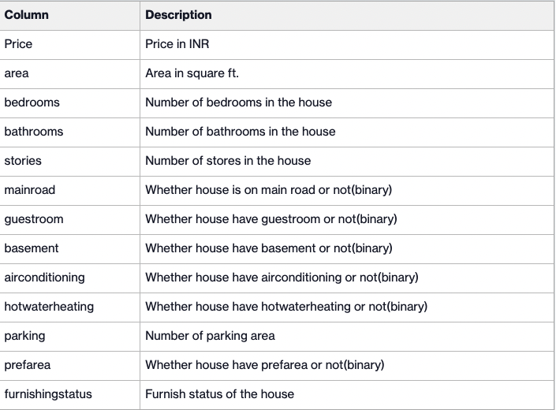

# Containerization
In this repo, the housing dataset is used. The housing dataset contains the prices and other attributes. There are 545 rows and 12 attributes (features) with a target column (price).
Following are the features:



Linear regression applied on correlated fields. You can find the model training and saving part in the <strong>creating_model_for_house_prediction.ipynb</strong>. 

To predict new house dataset code is written  as these basically, 

- Load model 
- Read input data 
- Predict prices
- Write prediction 

! In Dockerfile to use non root user , new user created and permissions are set. 

* Docker image was built with below command to match docker user with host user.
```bash
docker  build --build-arg HOST_USER_UID=`id -u` --build-arg HOST_USER_GID=`id -g` -t price_predict -f docker/Dockerfile 
  ```

* Docker image was built with below command to match docker user with host user.
```bash
docker run -v <host data path>:/opt/work-dir/data price_predict
  ```
